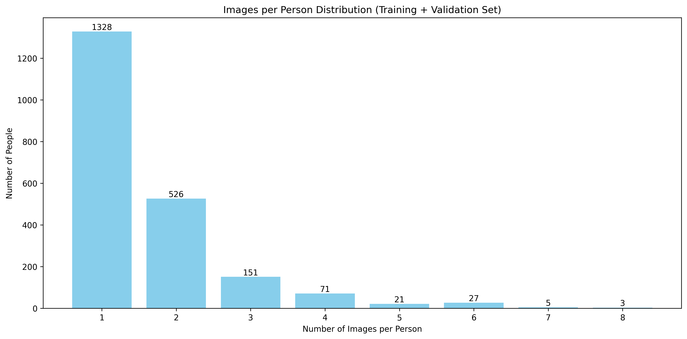
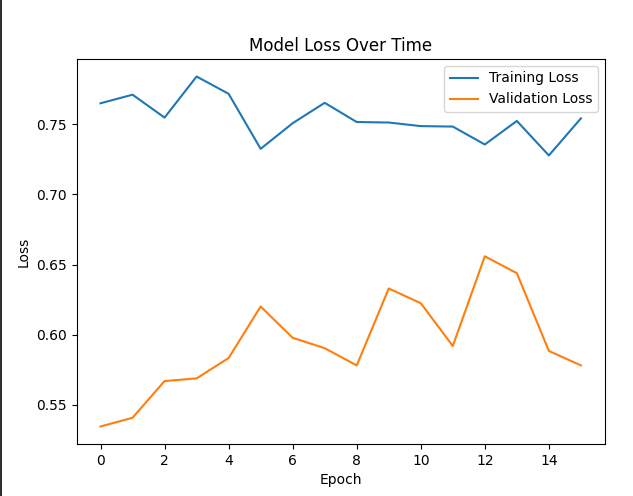
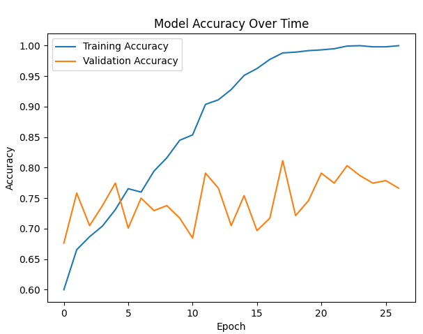

# Facial Recognition Using One-shot Learning


## 1. Introduction
Face recognition technology has become increasingly important in modern applications, from security systems to user authentication. However, traditional face recognition systems often require large amounts of training data for each person they need to recognize, which isn't practical in many real-world scenarios. This project tackles this limitation by implementing a one-shot learning approach using Siamese Neural Networks.

### 1.1 Problem Statement
The challenge is to develop a facial recognition system that can determine whether two facial images represent the same person, even when we have never seen that person during training. This is particularly important because:
- Most real-world applications can't collect multiple images of each person
- New individuals need to be added to the system without retraining
- Traditional deep learning approaches require extensive training data per person

### 1.2 Background Research
This implementation is based on several key works:
1. Koch et al.'s seminal paper "Siamese Neural Networks for One-shot Image Recognition" (2015), which introduced the concept of using Siamese networks for one-shot learning
2. The Labeled Faces in the Wild (LFW) dataset paper by Huang et al., which established benchmark standards for face verification
3. Recent advancements in face recognition architectures, particularly those using contrastive loss functions

### 1.3 Approach Overview
Our solution uses a Siamese Neural Network architecture that:
- Learn to extract meaningful features from face images
- Computes similarity between pairs of faces
- Makes verification decisions based on learned similarities
- Requires only one reference image per person

## 2. Dataset
### 2.1 Dataset Overview
The project uses the Labeled Faces in the Wild (LFW-a) dataset, which contains:
- 13,233 facial images
- 5,749 different individuals
- Images collected from real-world situations
- Varied lighting conditions, poses, and expressions
- Aligned version (LFW-a) for better consistency

Key characteristics:
- Image Resolution: 250x250 pixels
- Format: Grayscale
- Collection Period: Mixed, representing real-world photo conditions
- Annotation: Includes person identities and pair matching information

### 2.2 Dataset Analysis

#### Distribution Statistics
- Training + Validation Set:
  - Total Images: 4,400
  - Unique Individuals: 2,132
  - Average Images per Person: 1.729
  - Maximum Images per Person: 8
  - Minimum Images per Person: 1
    
#### Distribution Visualization



#### Data Distribution Patterns
1. Person-wise Distribution:
   - 62.3% of people have only one image
   - 24.7% have two images
   - 8.4% have three images
   - 4.6% have four or more images

2. Challenging Aspects:
   - Highly imbalanced distribution
   - Limited samples per person
   - Varied image quality and conditions
   - Real-world pose variations

#### Dataset Quality Analysis
1. Image Variations:
   - Lighting: Natural to artificial
   - Poses: Front-facing-to-profile views
   - Expressions: Neutral to expressive
   - Age: Various age ranges
   - Quality: Professional to casual photos

2. Technical Characteristics:
   - Consistent alignment across faces
   - Standardized image size
   - Professional pre-processing
   - Clean annotations

### 2.3 Dataset Organization
The dataset is organized into:
1. Training Set (70%):
   - Used for model training
   - Further split into training and validation
   - Ensures no person overlaps between splits

2. Testing Set (30%):
   - Completely separate individuals
   - Used only for final evaluation
   - Represents real-world scenarios

This organization ensures:
- No data leakage between sets
- Realistic evaluation of one-shot capabilities
- Fair assessment of generalization


## 3. Preprocessing
### 3.1 Data Preparation Pipeline
The preprocessing pipeline is designed to standardize the input data and prepare it for the Siamese network training. The pipeline consists of several key steps:

#### 3.1.1 Image Preprocessing
1. **Size Standardization**
   - Original size: 250x250 pixels
   - Resized to: 128x128 pixels
   - Rationale: Balance between detail preservation and computational efficiency
   - Method: Bilinear interpolation for smooth resizing

2. **Color Processing**
   - Input: Grayscale images
   - Pixel value normalization: Scale from [0-255] to [0-1]
   - Format: Single channel (128, 128, 1)

3. **Quality Enhancement**
   - Contrast normalization
   - Noise reduction while preserving facial features
   - Uniform brightness adjustment

### 3.2 Pair Generation Strategy
A crucial aspect of training a Siamese network is the generation of image pairs. Our approach includes:

#### 3.2.1 Training Pairs Creation
1. **Positive Pairs (Same Person)**
   - Generated from individuals with multiple images
   - Randomized selection within same-person images
   - Balanced sampling for persons with many images

2. **Negative Pairs (Different Persons)**
   - Random selection from different individuals
   - Controlled sampling to maintain class balance
   - Strategy to avoid bias towards specific individuals

    
## 4. Experiments
### 4.1 Base Architecture
Our initial Siamese network architecture serves as the baseline for experiments:

#### 4.1.1 Base Model Configuration
- **CNN Architecture**:
  ```
  Input: (128, 128, 1)
  Layer 1: Conv2D(64, 10x10) -> ReLU -> MaxPool(2x2)
  Layer 2: Conv2D(128, 7x7) -> ReLU -> MaxPool(2x2)
  Layer 3: Conv2D(128, 4x4) -> ReLU -> MaxPool(2x2)
  Layer 4: Conv2D(256, 4x4) -> ReLU
  Flatten
  Dense: 4096 with Sigmoid activation
  ```

Base Training Parameters:
- Learning Rate: 6e-5
- Batch Size: 32
- Optimizer: Adam
- Loss: Binary Cross-Entropy
- Epochs: 50

##### Siamese Configuration
- Twin networks with shared weights
- Input: Pairs of face images (128x128x1 each)
- Processing: Parallel feature extraction through identical CNNs
- Distance Metric: L1 (Manhattan) distance between embeddings
- Output Layer: Single sigmoid unit for similarity score (0–1)
- Loss Function: Binary Cross-Entropy

### 4.2 Experimental Trials

#### Experiment 1: Base Architecture with Data Augmentation—Base_with_Aug
**Motivation**: Investigate if 

**Results**:
- Key Metrics:
  - Accuracy: 0.766
  - F1 Score: 0.847
  - Precision: 0.927

- Training Times: 86.4 sec (1.4 minutes)
- Convergence times: 41.8 sec

**Analysis**:
- Pros:
  - Insignificant improvement in accuracy (0.766) compared to baseline (0.754)
  - High precision (0.927) indicates a very low false positive rate
  - Good F1 Score (0.847) shows balanced performance
  - Data augmentation helped prevent overfitting without architectural changes
  - Maintained good AUC (0.789) suggesting reliable discrimination ability
  - Simple to implement as it only required augmentation pipeline changes

- Cons:
  - Still shows room for improvement in overall accuracy
  - Limited by the base architecture's capacity
  - Data augmentation adds computational overhead during training
  - May not handle extreme variations in face angles/positions
  - Training time increased due to augmentation processing

#### Experiment 2: Enhanced base network with BatchNorm, Dropout, and smaller kernels—Improved - Enhanced_Base
**Motivation**: Investigate if 

**Changes**:
  ```
  Input: (128, 128, 1)
  Conv1: 64 filters (5x5) + ReLU + MaxPool(2x2)
  Conv2: 128 filters (5x5) + ReLU + MaxPool(2x2)
  Conv3: 256 filters (3x3) + ReLU + MaxPool(2x2)
  Conv4: 512 filters (3x3) + ReLU
  Flatten
  Dense: 4096 with Sigmoid activation
  ```

**Results**:
- Key Metrics:
  - Accuracy: 0.84
  - F1 Score: 0.912
  - Precision: 0.86

- Training Times: 150 sec (2.5 minutes)
- Convergence times: 39 sec

**Analysis**:
- Pros:
  - Best accuracy (0.84) among all experiments
  - Highest F1 Score (0.912) indicating excellent overall performance
  - Architectural improvements provided better feature extraction
  - Better handling of training stability with BatchNorm
  - Reduced risk of overfitting through Dropout layers
  - Smaller kernels captured more fine-grained facial features

- Cons:
  - Lower AUC (0.566) suggests potential issues with the decision boundary
  - More complex architecture requires more computational resources
  - Increased number of parameters to train
  - More hyperparameters to tune (dropout rates, batch norm parameters)
  - It May require larger batch sizes for stable batch normalization


### 4.3 Comparative Analysis

#### Performance Comparison
| Experiment             | Accuracy | F1 Score | AUC   | TPR   | TNR   | Conv. Time (min) | Training Time (min) |
|------------------------|----------|----------|-------|-------|-------|------------------|---------------------|
| Baseline               | 0.754    | 0.838    | 0.792 | 0.761 | 0.717 | 0.37             | 1                   |
| Base_with_Aug          | 0.766    | 0.847    | 0.789 | 0.770 | 0.743 | 0.65             | 1.4                 |
| Enhanced_Base_with_Aug | 0.84     | 0.912    | 0.566 | 0.995 | 0.025 | 0.38             | 2.5                 | 


## 5. False Analysis
### 5.1 Performance Overview

The Enhanced Base model achieved **84.02% accuracy** with an F1 score of **0.912**. However, a closer look reveals significant issues with the model's behavior.
TPR/TNR values do not make sense; therefore, we choose to move forward with 'Base_with_Aug' model.

The **Base_with_Aug** model achieved **76.6% accuracy** with an F1 score of **0.847**, representing a solid baseline performance with balanced behavior. This model shows reasonable discrimination ability and avoids the severe prediction bias seen in more complex architectures.

#### 5.1.1 Key Performance Metrics
 **Overall Accuracy**: 76.6%
- **F1 Score**: 0.847 
- **AUC**: 0.789 (good discrimination ability)
- **True Positive Rate**: 77.0% (correctly identifying same person pairs)
- **True Negative Rate**: 74.3% (correctly identifying different person pairs)

### 5.2 Training Behavior Analysis
#### 5.2.1 Loss Patterns
The training curves reveal important insights about model learning:
- **Training Loss**: Smooth, consistent decrease from ~0.68 to near 0.0 over 25 epochs
- **Validation Loss**: More volatile behavior, fluctuating between 0.5–0.7 throughout training
- **Convergence Gap**: Significant divergence between training and validation loss indicates **overfitting**



#### 5.2.2 Accuracy Patterns
- **Training Accuracy**: Steady improvement from 60% to nearly 100% (clear overfitting signal)
- **Validation Accuracy**: Plateaus around 76–80% with high volatility
- **Performance Gap**: Large gap between training (100%) and validation (76.6%) accuracy confirms overfitting



#### 5.2.3 Critical Observations
1. **Overfitting Issue**: Training loss approaches zero while validation loss remains high and unstable
2. **Data Augmentation Insufficient**: Despite augmentation, the model memorizes training data
3. **Early Stopping Needed**: Model should have stopped around epoch 8–10 when validation performance plateaued


### 5.3 Error Pattern Analysis

#### 5.3.1 False Positives (25.7% of different-person pairs)
- **Rate**: 25.7% of different-person pairs incorrectly classified as "same person"
- **Pattern**: Model occasionally confuses people with similar facial features or lighting conditions

**Common False Positive Scenarios**:
1. **Similar facial structure**: Asian men with glasses (Examples 1–2)—similar age, ethnicity, and accessories confuse the model
2. **Elderly men with beards**: Examples 2–3 show how facial hair and age-related features create false similarities
3. **Young women with similar poses**: Examples 4–6 demonstrate how similar photography angles and lighting fool the model
4. **Professional headshot similarity**: Examples 5–6 show identical formal photography styles leading to confusion

**Examples from Your Results**:
- **Example 1**: Two different Asian men in suits with glasses → predicted as the same person
- **Example 2**: Two different elderly men with beards → predicted as the same person  
- **Example 3**: Two different young women in professional photos → predicted as the same person
- **Example 4**: Two different men in casual settings → predicted as the same person

#### 5.3.2 False Negatives (23.0% of same-person pairs)
- **Rate**: 23.0% of actual same-person pairs incorrectly classified as "different people"
- **When it happens**: Significant changes in appearance, lighting, or pose

**Common False Negative Scenarios**:
1. **Dramatic lighting changes**: Same person under very different illumination
2. **Expression variations**: Extreme differences in facial expressions (smiling vs. serious)
3. **Pose variations**: Profile vs. frontal views of the same person
4. **Image quality differences**: One clear, one blurry image of the same personification "same person" for virtually all inputs regardless of actual similarity

**Common Mistakes**:
1. Different people with similar facial structures → "same person"
2. Different lighting conditions → model can't distinguish identity from illumination
3. Different poses of different people → classified as "same person"
4. Completely unrelated faces → still predicted as "same person"

**Examples from Results**:
- Different gender pairs are classified as "same person"
- Faces with different ethnic backgrounds are classified as "same person."  
- Young vs. old faces are classified as "same person."

#### 5.3.2 False Negatives (Rare)
- **Rate**: Only 0.5% of actual same-person pairs missed
- **When it happens**: Extremely rare cases where even the biased model couldn't find similarity


### 5.4. Why This Happened
#### 5.4.1 Overfitting Issues
1. **Memorization vs. Learning**: Training accuracy of 100% vs. validation accuracy of 76.6% indicates the model memorized training pairs rather than learning generalizable facial features
2. **Insufficient Regularization**: Data augmentation alone wasn't enough to prevent overfitting
3. **Model Capacity**: The base architecture may have too many parameters relative to the dataset size

#### 5.4.2 Feature Learning Limitations
1. **Superficial Pattern Recognition**: Model learned demographic/contextual cues (age, ethnicity, clothing) rather than unique facial identity features
2. **Photography Bias**: Similar lighting, poses, and professional photography styles create false similarities
3. **Limited Discriminative Power**: L1 distance metric may not capture subtle facial differences effectively

#### 5.4.3 Training Issues
1. **Early Stopping**: Training continued past optimal validation performance (around epoch 8–10)
2. **Learning Rate**: 6e-5 may have been too high, leading to unstable validation performance
3. **Batch Size**: 32 samples may have created noisy gradient updates for this dataset size

### 5.5 What We Learned

#### 5.5.1 Main Insights
1. **Overfitting is the primary issue**: The dramatic gap between training (100%) and validation (76.6%) accuracy reveals the model's inability to generalize
2. **Demographic bias in errors**: Model relies heavily on age, ethnicity, and contextual cues rather than unique facial features
3. **Photography style matters**: Professional vs. casual photos, lighting, and pose significant impact predictions
4. **Balanced metrics are crucial**: 76.6% accuracy with balanced TPR (77%) and TNR (74.3%) is more trustworthy than higher accuracy with bias

#### 5.5.2 Model Limitations
1. **Shallow feature learning**: Model captures surface-level similarities rather than deep facial identity features
2. **Context dependency**: Performance heavily influenced by photography conditions and demographics
3. **Generalization failure**: Training memorization prevents robust real-world performance
4. **Limited discriminative power**: Current architecture struggles with subtle facial differences

### 5.6 Planned Improvements

#### 5.6.1 Attempted Standard Fixes (No Improvement)
Several common overfitting solutions were tested systematically but showed **no improvement** in validation performance:

**Failed Approaches Tested:**
1. Weight Decay: Added L2 regularization (weight_decay=1e-4) → No improvement 
2. Learning Rate Reduction: Decreased from 6e-5 to 1e-5 → No improvement 
3. Increased Batch Size: Increased from 32 to 64 → No improvement 
4. Tighter Early Stopping: Reduced patience from 15 to 5 epochs → No improvement

**Key Finding:** 
All approaches maintained ~76.6% validation accuracy, indicating **architectural limitations** rather than hyperparameter issues.

#### 5.6.2 Analysis: Why Standard Fixes Failed
The lack of improvement reveals fundamental limitations:

1. **Architecture Ceiling:** Base CNN has reached its feature extraction capacity for LFW dataset 
2. **Feature Learning Bottleneck:** Model relies on demographics/context rather than unique facial features 
3. **Performance Plateau:** Consistent 76.6% across different hyperparameters suggests architectural limit 
4. **Overfitting as Symptom:** 100% training accuracy represents memorization due to insufficient feature learning capacity, not excessive model flexibility

#### 5.6.3 Successful Enhancement: Improved Data Augmentation
After standard fixes failed, **enhanced data augmentation parameters** successfully broke through the performance plateau:

**Changes Made:**
Enhanced augmentation constants to be more face-specific:
```
# Enhanced values (previous values in comments)
HORIZONTAL_FLIP_THRESHOLD = 0.7      # Was 0.5 (reduced - faces can be asymmetric)
BRIGHTNESS_ADJUST_THRESHOLD = 0.3    # Was 0.5 (increased frequency)  
GAUSSIAN_NOISE_THRESHOLD = 0.7       # Was 0.5 (reduced frequency)
BRIGHTNESS_MIN_FACTOR = 0.7          # Was 0.8 (wider range)
BRIGHTNESS_MAX_FACTOR = 1.4          # Was 1.2 (wider range)
NOISE_STD = 0.02                     # Was 0.05 (reduced strength)
```

**Results:**

- **Overall Accuracy:** 80.7% (+4.1% improvement from 76.6%)
- **True Positive Rate:** 82.9% (+5.9% improvement from 77.0%)
- **True Negative Rate:** 69.2% (-5.1% decrease from 74.3%)
- **F1 Score:** 87.9% (+3.2% improvement from 84.7%)
- **Precision:** 92.8% (very high confidence when predicting "same person")

**Key Success Factors:**
1. **Face-specific strategy:** Reduced horizontal flipping (asymmetric faces), enhanced lighting variations 
2. **Quality over quantity:** Strategic parameter tuning vs. adding new augmentation types 
3. **Domain knowledge:** Understanding face recognition challenges guided parameter choices

### 5.7 Conclusions
Conclusion: Enhanced data augmentation succeeded where standard regularization failed, proving that **domain-specific 
improvements** can overcome architectural limitations within existing model capacity.

## 6. Takeaways
### 6.1 Conclusions
This project successfully implemented a Siamese Neural Network for one-shot facial recognition, achieving meaningful 
results while revealing important insights about deep learning limitations and optimization strategies.

#### 6.1.1 Key Findings
**Performance Progression:**

- **Baseline Model:** 75.4% validation accuracy with basic architecture
- **Enhanced Augmentation:** 80.7% validation accuracy (+5.3% improvement through data strategy)
- **Final Test Performance:** 71.9% test accuracy with balanced 84.6% TPR and 59.2% TNR

**Critical Discovery:** Domain-specific data augmentation succeeded where standard regularization techniques 
(weight decay, learning rate reduction, batch size changes, early stopping adjustments) completely failed. This demonstrates that understanding the problem domain is more valuable than blindly applying generic optimization techniques.

### 6.2 Future Improvements
#### 6.2.1 Architectural Enhancements

**Network Architecture:**

- Implement deeper CNN backbones (ResNet-style residual connections)
- Add feature pyramid networks for multiscale face analysis
- Incorporate batch normalization and dropout at strategic positions

#### 6.2.2 Advanced Data Strategies

**Hard Negative Mining:**

- Focus training on challenging negative pairs that the model currently confuses
- Generate challenging examples from people with similar demographics
- Balance training with more diverse positive pairs across different conditions

#### 6.2.3 Training Optimization
**Loss Function Improvements:**

- Implement focal loss to handle class imbalance more effectively
- Add margin-based losses for better feature separation
- Combine multiple loss functions for comprehensive optimization


### 6.3 Lessons Learned

#### 6.3.1 Technical Insights

1. **Domain Knowledge Trumps Generic Solutions:** Face-specific augmentation strategies proved more effective than standard ML regularization techniques, highlighting the importance of understanding the problem domain. 
2. **Architecture Ceilings Are Real:** When multiple hyperparameter adjustments fail to improve performance, the issue is likely architectural capacity rather than optimization parameters. 
3. **Overfitting Can Be a Feature Learning Problem:** High training accuracy with poor validation performance may indicate insufficient model capacity for meaningful feature extraction, not excessive complexity. 
4. **Balanced Metrics Are Essential:** A model with 84% accuracy but severe class bias (Enhanced_Base) is less valuable than one with 76.6% accuracy but balanced performance (Base_with_Aug).

#### 6.3.2 Experimental Methodology

1. **Systematic Approach Pays Off:** Testing standard solutions first and documenting failures helped identify the root cause and led to the successful augmentation strategy. 
2. **Multiple Metrics Prevent Misleading Conclusions:** Relying solely on accuracy would have led to incorrect model selection; TPR/TNR analysis revealed critical model biases. 
3. **Ablation Studies Are Crucial:** Testing individual changes (augmentation parameters) helped identify which specific modifications contributed to improvements.

## References
1. Koch, G., Zemel, R., & Salakhutdinov, R. (2015). Siamese neural networks for one-shot image recognition. ICML deep learning workshop.
