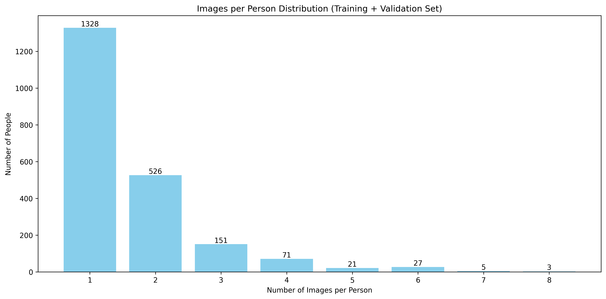
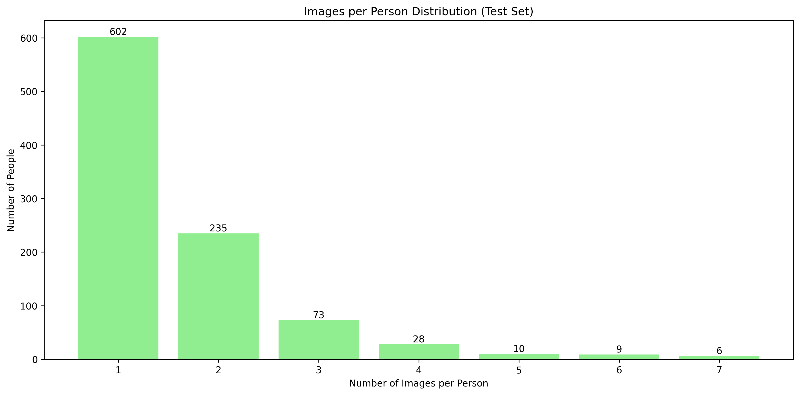

# Facial Recognition Using One-shot Learning
## Implementation Report

## 1. Introduction
This project implements a facial recognition system using Siamese Neural Networks for one-shot learning, based on the paper "Siamese Neural Networks for One-shot Image Recognition." The primary goal is to develop a system capable of determining whether two facial images represent the same person, even when the person was not seen during training.

The implementation uses the Labeled Faces in the Wild (LFW-a) dataset, which presents real-world challenges in face recognition due to its varied lighting conditions, poses, and expressions. Our approach focuses on learning a similarity metric between faces rather than traditional classification, making it suitable for recognizing previously unseen individuals.

## 2. Dataset Analysis

### 2.1 Dataset Overview
- **Dataset**: Labeled Faces in the Wild (LFW-a version)
- **Image Format**: Grayscale images, resized from 250x250 to 128x128
- **Input Shape**: (128, 128, 1)
- **Split Strategy**: Train/Validation/Test with validation split of 20%

### 2.2 Data Distribution
#### Training + Validation Set
- Total images: 2,200
- Total unique persons: 2,132
- Average images per person: 1.615
- Images per person distribution:

##### Distribution Visualization


   #### Training + Validation Set Analysis
   - Most common case: 1 image per person (62.3% of people)
   - Least common case: 8 images per person (0.14% of people)
   - Dataset imbalance ratio: 8:1 (max:min images per person)

#### Test Set
- Total images: 1000
- Total unique persons: 963
- Average images per person: 1.609

##### Distribution Visualization


   #### Test Set Analysis
   - Most common case: 1 image per person (62.5% of people)
   - Least common case: 7 images per person (0.62% of people)
   - Dataset imbalance ratio: 7:1 (max:min images per person)

##### Key Observations:
1. **Highly Imbalanced Distribution**:
   - In both sets, the majority of people (>60%) have only one image
   - Very few individuals have more than 4 images

2. **Training Challenges**:
   - Limited data per person makes learning person-specific features difficult
   - High imbalance requires careful consideration in training strategy
   - Most validation will be on single-image cases

3. **Distribution Similarity**:
   - Train and test sets show similar patterns
   - Both have heavily skewed distributions towards single images
   - Similar average images per person (1.615 vs 1.609)

### 2.3 Dataset Split Strategy
- **Validation Split**: 20% of training data
- **Data Preprocessing Pipeline**:
  1. Image loading and grayscale conversion
  2. Resizing from the original 250x250 to 128x128
  3. Pixel normalization (0-255 → 0-1 range)
  4. Ensuring a consistent input shape (128, 128, 1)

## 3. Model Architecture

### 3.1 Implementation Details
#### Base Network Structure
- **Input Layer**: 128x128x1 (grayscale images)
- **CNN Architecture**:
  ```
  [Add your CNN layer structure here]
  ```

#### Siamese Configuration
- Twin networks with shared weights
- Input: Pairs of face images
- Output: Similarity score

### 3.2 Design Choices
#### Architecture Decisions
1. **Input Size**: Optimized to 128x128 to balance detail preservation and computational efficiency
2. **Grayscale Format**: Reduces input complexity while maintaining essential facial features
3. **Shared Weights**: Ensures identical feature extraction from both images

#### Parameter Selection
- **Random Seed**: 42 (for reproducibility)
- **Validation Split**: 0.2 (20% of training data)
- **Preprocessing**: 
  - Grayscale conversion for reduced complexity
  - Normalization to [0,1] range for stable training