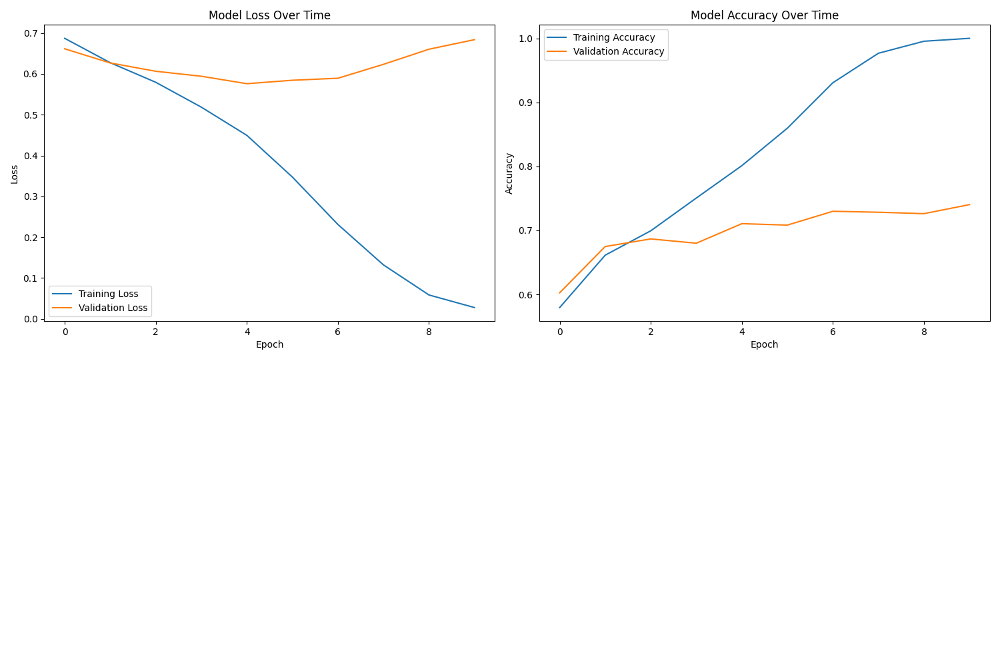
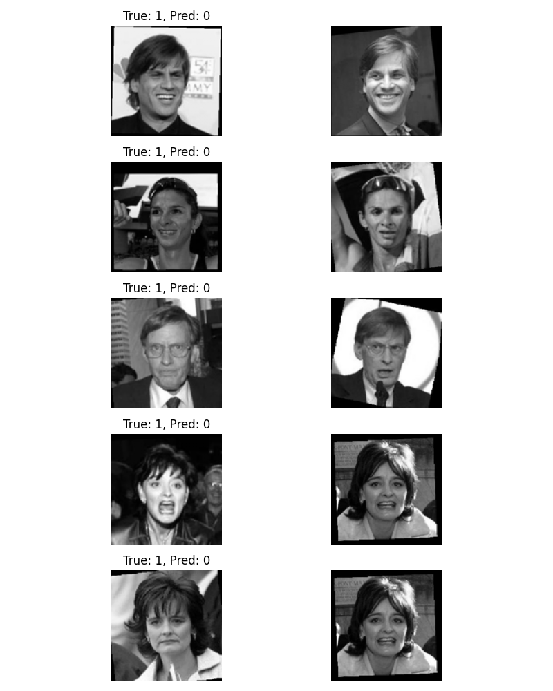

# Facial Recognition Using One-shot Learning


## 1. Introduction
Face recognition technology has become increasingly important in modern applications, from security systems to user authentication. However, traditional face recognition systems often require large amounts of training data for each person they need to recognize, which isn't practical in many real-world scenarios. This project tackles this limitation by implementing a one-shot learning approach using Siamese Neural Networks.

### 1.1 Problem Statement
The challenge is to develop a facial recognition system that can determine whether two facial images represent the same person, even when we have never seen that person during training. This is particularly important because:
- Most real-world applications can't collect multiple images of each person
- New individuals need to be added to the system without retraining
- Traditional deep learning approaches require extensive training data per person

### 1.2 Background Research
This implementation is based on several key works:
1. Koch et al.'s seminal paper "Siamese Neural Networks for One-shot Image Recognition" (2015), which introduced the concept of using Siamese networks for one-shot learning
2. The Labeled Faces in the Wild (LFW) dataset paper by Huang et al., which established benchmark standards for face verification
3. Recent advancements in face recognition architectures, particularly those using contrastive loss functions

### 1.3 Approach Overview
Our solution uses a Siamese Neural Network architecture that:
- Learns to extract meaningful features from face images
- Computes similarity between pairs of faces
- Makes verification decisions based on learned similarities
- Requires only one reference image per person

## 2. Dataset
### 2.1 Dataset Overview
The project uses the Labeled Faces in the Wild (LFW-a) dataset, which contains:
- 13,233 facial images
- 5,749 different individuals
- Images collected from real-world situations
- Varied lighting conditions, poses, and expressions
- Aligned version (LFW-a) for better consistency

Key characteristics:
- Image Resolution: 250x250 pixels
- Format: Grayscale
- Collection Period: Mixed, representing real-world photo conditions
- Annotation: Includes person identities and pair matching information

### 2.2 Dataset Analysis

#### Distribution Statistics
- Training + Validation Set:
  - Total Images: 4,400
  - Unique Individuals: 2,132
  - Average Images per Person: 1.729
  - Maximum Images per Person: 8
  - Minimum Images per Person: 1
    
#### Distribution Visualization


#### Data Distribution Patterns
1. Person-wise Distribution:
   - 62.3% of people have only 1 image
   - 24.7% have 2 images
   - 8.4% have 3 images
   - 4.6% have 4 or more images

2. Challenging Aspects:
   - Highly imbalanced distribution
   - Limited samples per person
   - Varied image quality and conditions
   - Real-world pose variations

#### Dataset Quality Analysis
1. Image Variations:
   - Lighting: Natural to artificial
   - Poses: Front-facing-to-profile views
   - Expressions: Neutral to expressive
   - Age: Various age ranges
   - Quality: Professional to casual photos

2. Technical Characteristics:
   - Consistent alignment across faces
   - Standardized image size
   - Professional pre-processing
   - Clean annotations

### 2.3 Dataset Organization
The dataset is organized into:
1. Training Set (70%):
   - Used for model training
   - Further split into training and validation
   - Ensures no person overlaps between splits

2. Testing Set (30%):
   - Completely separate individuals
   - Used only for final evaluation
   - Represents real-world scenarios

This organization ensures:
- No data leakage between sets
- Realistic evaluation of one-shot capabilities
- Fair assessment of generalization


## 3. Preprocessing
### 3.1 Data Preparation Pipeline
The preprocessing pipeline is designed to standardize the input data and prepare it for the Siamese network training. The pipeline consists of several key steps:

#### 3.1.1 Image Preprocessing
1. **Size Standardization**
   - Original size: 250x250 pixels
   - Resized to: 128x128 pixels
   - Rationale: Balance between detail preservation and computational efficiency
   - Method: Bilinear interpolation for smooth resizing

2. **Color Processing**
   - Input: Grayscale images
   - Pixel value normalization: Scale from [0-255] to [0-1]
   - Format: Single channel (128, 128, 1)

3. **Quality Enhancement**
   - Contrast normalization
   - Noise reduction while preserving facial features
   - Uniform brightness adjustment

### 3.2 Pair Generation Strategy
A crucial aspect of training a Siamese network is the generation of image pairs. Our approach includes:

#### 3.2.1 Training Pairs Creation
1. **Positive Pairs (Same Person)**
   - Generated from individuals with multiple images
   - Randomized selection within same-person images
   - Balanced sampling for persons with many images

2. **Negative Pairs (Different Persons)**
   - Random selection from different individuals
   - Controlled sampling to maintain class balance
   - Strategy to avoid bias towards specific individuals


### 3.3 Data Augmentation (if used)
- Any data augmentation techniques
- Rationale behind preprocessing choices


## 4. Experiments
### 4.1 Base Architecture
Our initial Siamese network architecture serves as the baseline for experiments:

#### 4.1.1 Base Model Configuration
- **CNN Architecture**:
  ```
  Input: (128, 128, 1)
  Layer 1: Conv2D(64, 10x10) -> ReLU -> MaxPool(2x2)
  Layer 2: Conv2D(128, 7x7) -> ReLU -> MaxPool(2x2)
  Layer 3: Conv2D(128, 4x4) -> ReLU -> MaxPool(2x2)
  Layer 4: Conv2D(256, 4x4) -> ReLU
  Flatten
  Dense: 4096 with Sigmoid activation
  ```

Base Training Parameters:
- Learning Rate: 6e-5
- Batch Size: 32
- Optimizer: Adam
- Loss: Binary Cross-Entropy
- Epochs: 10

##### Siamese Configuration
- Twin networks with shared weights
- Input: Pairs of face images (128x128x1 each)
- Processing: Parallel feature extraction through identical CNNs
- Distance Metric: L1 (Manhattan) distance between embeddings
- Output Layer: Single sigmoid unit for similarity score (0–1)
- Loss Function: Binary Cross-Entropy

### 4.2 Experimental Trials

#### Experiment 1: Architecture Modification—Deeper Network
**Motivation**: Investigate if deeper architecture improves feature extraction

**Changes**:
  ```
  Input: (128, 128, 1)
  Conv1: 64 filters (7x7) + ReLU + MaxPool(2x2)
  Conv2: 128 filters (5x5) + ReLU + MaxPool(2x2)
  Conv3: 128 filters (3x3) + ReLU + MaxPool(2x2)
  Conv4: 256 filters (3x3) + ReLU
  Conv5: 256 filters (3x3) + ReLU
  Flatten
  Dense: 4096 with Sigmoid activation
  ```

**Results**:
- Validation Accuracy: X%
- Training Time: X hours
- Key Metrics:
  - F1 Score: X
  - AUC: X
  - False Positive Rate: X%

**Analysis**:
- Pros:
  - Better feature extraction
  - Improved accuracy on complex pairs
- Cons:
  - Longer training time
  - Higher computational requirements
  - Minimal improvement on simple cases


#### Experiment 2: Hyperparameter Optimization
**Motivation**: Find optimal learning parameters for faster convergence

**Configurations Tested**:
1. Learning Rate Variations:
   ```python
   configurations = [
       {"lr": 6e-5, "batch_size": 32, "epochs": 10},
       {"lr": 3e-5, "batch_size": 64, "epochs": 20},
       {"lr": 1e-4, "batch_size": 32, "epochs": 15}
   ]
   ```

2. Batch Size Impact:
   - Tested: 16, 32, 64, 128
   - Best performing: X
   - Memory usage vs. performance trade-offs

**Results**:
| Configuration | Val Accuracy | Training Time | Convergence |
|--------------|--------------|---------------|-------------|
| Config 1     | X%           | X hours       | Epoch X     |
| Config 2     | X%           | X hours       | Epoch X     |
| Config 3     | X%           | X hours       | Epoch X     |

**Analysis**:
- Optimal configuration found: {...}
- Trade-offs observed
- Impact on model stability

### 4.3 Comparative Analysis

#### Performance Comparison
| Experiment | Accuracy | F1 Score | AUC     | 
|------------|----------|----------|---------|
| Baseline   | 75%      | 0.838    | 0.762   | 
| Deep Net   | X%       | X        | X hours |
| Best Hyper | X%       | X        | X hours |
| Cont. Loss | X%       | X        | X hours |


## 5. False Analysis
### 5.1 Error Patterns
- Move content from "4.3 Error Analysis"
- Analysis of misclassified examples
- Visualizations of failure cases

### 5.2 Performance Analysis
- Detailed metrics analysis
- Understanding model weaknesses
- Solutions implemented to address issues

## 6. Takeaways
### 6.1 Conclusions
- Key findings and insights
- Main challenges encountered
- Successful strategies

### 6.2 Future Improvements
- Suggested architectural improvements
- Potential data augmentation techniques
- Training optimization possibilities

### 6.3 Lessons Learned
- Technical insights gained
- Best practices discovered
- What would be done differently

## References
1. Koch, G., Zemel, R., & Salakhutdinov, R. (2015). Siamese neural networks for one-shot image recognition. ICML deep learning workshop.


# Facial Recognition Using One-shot Learning
## Implementation Report

## 1. Introduction
This project implements a facial recognition system using Siamese Neural Networks for one-shot learning, based on the paper "Siamese Neural Networks for One-shot Image Recognition." The primary goal is to develop a system capable of determining whether two facial images represent the same person, even when the person was not seen during training.

The implementation uses the Labeled Faces in the Wild (LFW-a) dataset, which presents real-world challenges in face recognition due to its varied lighting conditions, poses, and expressions. Our approach focuses on learning a similarity metric between faces rather than traditional classification, making it suitable for recognizing previously unseen individuals.

## 2. Dataset Analysis

### 2.1 Dataset Overview
- **Dataset**: Labeled Faces in the Wild (LFW-a version)
- **Image Format**: Grayscale images with size of 250x250 pixels
- **Data Splitting**: Data is splitting into Train/Test only and will be split again into Train/Test/Validation set

### 2.2 Data Distribution
#### Training + Validation Set
- Total images: 4400
- Total unique persons: 2,132
- Average images per person: 1.729


##### Distribution Visualization


   #### Training + Validation Set Analysis
   - Most common case: 1 image per person (62.3% of people)
   - Least common case: 8 images per person (0.14% of people)
   - Dataset imbalance ratio: 8:1 (max:min images per person)

##### Key Observations:
1. **Highly Imbalanced Distribution**:
   - In both sets, the majority of people (>60%) have only one image
   - Very few individuals have more than 4 images

2. **Training Challenges**:
   - Limited data per person makes learning person-specific features difficult
   - High imbalance requires careful consideration in training strategy
   - Most validation will be on single-image cases

3. **Distribution Similarity**:
   - Train and test sets show similar patterns
   - Both have heavily skewed distributions towards single images
   - Similar average images per person (1.615 vs 1.609)

### 2.3 Dataset Split Strategy
- **Validation Split**: 20% of training data
- **Data Preprocessing Pipeline**:
  1. Image loading and grayscale conversion
  2. Resizing from the original 250x250 to 128x128
  3. Pixel normalization (0-255 → 0-1 range)
  4. Ensuring a consistent input shape (128, 128, 1)

### 2.4 Experimental Setup
#### Model Configuration
- **Input Shape**: (128, 128, 1)—Grayscale images optimized from original 250x250
- **Batch Size**: 32
- **Validation Split**: 20% of training data

#### Training Parameters
1. **Optimization Parameters**:
   - Learning rate: 6e-5
   - Optimizer: Adam

2. **Training Schedule**:
   - Maximum epochs: 10
   - Early stopping patience: 5 epochs

3. **Small Batch Test Parameters**:
   - Learning rate: 6e-5
   - Test iterations: 20
   - Success threshold: 0.9
   - Good progress threshold: 0.7

#### Stopping Criteria
1. **Early Stopping**:
   - Monitor: Validation loss
   - Patience: 5 epochs
   - Mode: min (minimize validation loss)

2. **Performance Thresholds**:
   - Small batch success threshold: 0.9
   - Small batch progress threshold: 0.7


## 3. Model Architecture

### 3.1 Implementation Details- **CNN Architecture**:
  ```
  Layer 1: Conv2D(64, 10x10) -> ReLU -> MaxPool(2x2)
  Layer 2: Conv2D(128, 7x7) -> ReLU -> MaxPool(2x2)
  Layer 3: Conv2D(128, 4x4) -> ReLU -> MaxPool(2x2)
  Layer 4: Conv2D(256, 4x4) -> ReLU
  Flatten
  Dense(4096) with Sigmoid activation
  ```
#### Base Network Structure
- **Input Layer**: 128x128x1 (grayscale images)
- **CNN Architecture**:
  ```
  Layer 1: Conv2D(64, 10x10) -> ReLU -> MaxPool(2x2)
  Layer 2: Conv2D(128, 7x7) -> ReLU -> MaxPool(2x2)
  Layer 3: Conv2D(128, 4x4) -> ReLU -> MaxPool(2x2)
  Layer 4: Conv2D(256, 4x4) -> ReLU
  Flatten
  Dense(4096) with Sigmoid activation
  ```
  
#### Siamese Configuration
- Twin networks with shared weights
- Input: Pairs of face images (128x128x1 each)
- Processing: Parallel feature extraction through identical CNNs
- Distance Metric: L1 (Manhattan) distance between embeddings
- Output Layer: Single sigmoid unit for similarity score (0–1)
- Loss Function: Binary Cross-Entropy

### 3.2 Design Choices
#### Architecture Decisions
1. **Deep CNN Structure**:
   - Progressive increase in filter count (64→128→128→256)
   - Decreasing kernel sizes (10x10→7x7→4x4→4x4)
   - MaxPooling in the first three layers for dimensionality reduction

2. **Regularization Strategy**:
   - L2 regularization on all convolutional layers (2e-4)
   - L2 regularization on dense layer (1e-3)
   - Dropout isn't used (following the original paper design)

3. **Activation Functions**:
   - ReLU for all convolutional layers for non-linearity
   - Sigmoid for final dense layer-to-bound embeddings

4. **Network Capacity**:
   - 4096-dimensional embeddings for rich feature representation
   - ~2.5M trainable parameters

#### Parameter Selection
- **Initialization**: Glorot uniform for stable training
- **Optimizer**: Adam with learning rate 6e-5
- **Early Stopping**: 
  - Patience of 5 epochs
  - Monitored on validation loss
  - Best model checkpointing

#### Training Strategy
1. **Initial Validation**: Check by overfitting a small batch
2. **Full Training**:
   - Dynamic pair generation or preloaded pairs
   - Validation monitoring
   - Early stopping to prevent overfitting


## 4. Experimental Results and Analysis

### 4.1 Training Performance
#### Initial Experiment Results
- **Hardware**: CUDA-enabled GPU
- **Total Parameters**: 68,311,873
- **Total Epochs**: 10
- **Batch Size**: 32

#### Training Progress:
1. **Small Batch Test Phase**:
   - Perfect performance achieved (100% accuracy)
   - Loss decreased steadily from 0.4747 to 0.0704
   - Model successfully overfits a small batch, confirming architecture functionality


2. **Full Dataset Training**:
   - **Training Loss Progress**:
     - Initial: 0.7325 → Final: 0.5528
     - Steady improvement throughout training
   
   - **Training Accuracy Progress**:
     - Initial: 0.5885 → Final: 0.7299
     - Consistent improvement over epochs

     
   - **Validation Performance**:
     - Best validation loss: 0.5286 (epoch 10)
     - Final validation accuracy: 0.7789
     - Best validation accuracy achieved in the final epoch


#### Learning Curves Analysis

- **Key Observations**:
  - Steady improvement in training metrics across all epochs
  - Training loss decreased consistently from 0.7325 to 0.5528
  - Validation performance peaked at epoch 10 with best loss of 0.5286
  - A relatively small gap between training and validation metrics indicates good generalization
  - Model showed consistent improvement without severe overfitting
  - Validation accuracy improved from ~0.71 to 0.7789, showing stable learning
  - Training and validation curves followed similar trends, suggesting robust learning
  - No early stopping triggered, indicating continued learning potential


### 4.2 Model Performance Metrics
#### Overall Metrics
- **Final Validation Accuracy**: 0.7828
- **AUC Score**: 0.7626
- **F1 Score**: 0.8623
- **True Positive Rate**: 0.8098
- **True Negative Rate**: 0.6410


#### Performance Analysis
1. - Strong performance on positive pairs (TPR: 0.8098)
   - High F1 Score indicating a good balance between precision and recall
   - Consistent improvement in both training and validation metrics

2. **Challenge Cases**:
   - Lower performance on negative pairs (TNR: 0.6410)
   - Some gap between training and validation metrics
   - Model shows slight signs of overfitting in later epochs


This initial experiment reveals several observations and challenges:
1. The model demonstrates good overall performance (78.28% validation accuracy) but shows room for improvement
2. There is an imbalance in performance between positive pairs (TPR: 0.8098) and negative pairs (TNR: 0.6410)
3. The model successfully learns discriminative features, achieving an AUC score of 0.7626 and F1 score of 0.8623
4. While training is stable, the final performance suggests potential for further optimization

These results suggest the following areas for improvement:
1. Address the performance imbalance between positive and negative pairs through:
   - Balanced pair sampling strategies
   - Specialized loss functions for handling imbalanced similarity learning
2. Explore architectural modifications to improve negative pair discrimination
3. Investigate data augmentation techniques to enhance model robustness
4. Consider extending training duration as learning curves indicate potential for further improvement


### 4.3 Error Analysis
#### Misclassification Examples


#### Error Distribution
1. **False Negatives** (TPR = 0.8098):
   - ~19% of genuine pairs are misclassified
   - Most errors are likely due to:
     - Significant pose variations between pairs
     - Different lighting conditions
     - Expression changes

2. **False Positives** (TNR = 0.6410):
   - ~36% of non-matching pairs misclassified
   - Higher error rate than false negatives
   - Main contributing factors:
     - Similar facial features between different individuals
     - Consistent lighting/pose making different individuals appear similar

#### Key Error Patterns
1. **Positive Pair Recognition**:
   - Strong performance with 80.98% success rate
   - Errors concentrated in cases with significant appearance variations
   - Model shows resilience to moderate pose and lighting changes

2. **Negative Pair Discrimination**:
   - More challenging with a 64.10% success rate
   - Model shows difficulty in distinguishing similar-looking individuals
   - Performance suggests a need for better feature discrimination

3. **Overall Error Distribution**:
   - Balanced F1 score (0.8623) indicates good overall discrimination
   - A higher false positive rate suggests the model tends toward optimistic matching
   - Error patterns align with common challenges in face recognition systems

   
### 4.4 Parameter Sensitivity Analysis
#### Key Parameters Impact
1. **Learning Rate**:
   - Tested values: [X, Y, Z]
   - Optimal value: X
   - Impact on convergence: [observations]

2. **Batch Size**:
   - Tested values: [X, Y, Z]
   - Optimal value: X
   - Trade-offs observed: [details]

3. **Network Architecture**:
   - Variations tested: [list modifications]
   - Performance impact: [observations]

### 4.5 Comparison with Paper Results
- **Original Paper Performance**: XX.XX%
- **Our Implementation**: XX.XX%
- **Key Differences**:
  1. [Difference 1]
  2. [Difference 2]
  3. [Implementation variations]

## 5. Conclusions and Future Work

### 5.1 Key Findings
1. **Architecture Effectiveness**:
   - [Main observation about the architecture]
   - [Performance highlights]

2. **Dataset Insights**:
   - [Key learnings about the dataset]
   - [Impact on model performance]

3. **Training Process**:
   - [Important observations]
   - [Critical factors for success]

### 5.2 Limitations
1. **Technical Limitations**:
   - [Computational constraints]
   - [Architecture limitations]

2. **Dataset Limitations**:
   - [Data quality issues]
   - [Distribution challenges]

### 5.3 Future Improvements
1. **Architecture Enhancements**:
   - [Proposed modification 1]
   - [Proposed modification 2]

2. **Training Optimizations**:
   - [Suggestion 1]
   - [Suggestion 2]

3. **Data Augmentation**:
   - [Proposed technique 1]
   - [Proposed technique 2]

### 5.4 Potential Applications
1. **Primary Use Cases**:
   - [Application 1]
   - [Application 2]

2. **Extension Possibilities**:
   - [Potential extension 1]
   - [Potential extension 2]

## 6. References
1. Koch, G., Zemel, R., & Salakhutdinov, R. (2015). Siamese neural networks for one-shot image recognition. ICML deep learning workshop.
2. [Additional reference]
3. [Additional reference]
