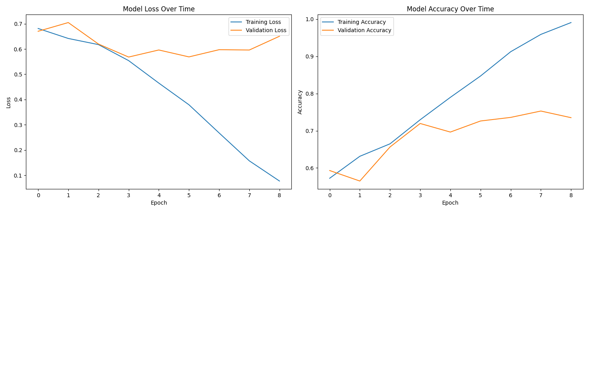
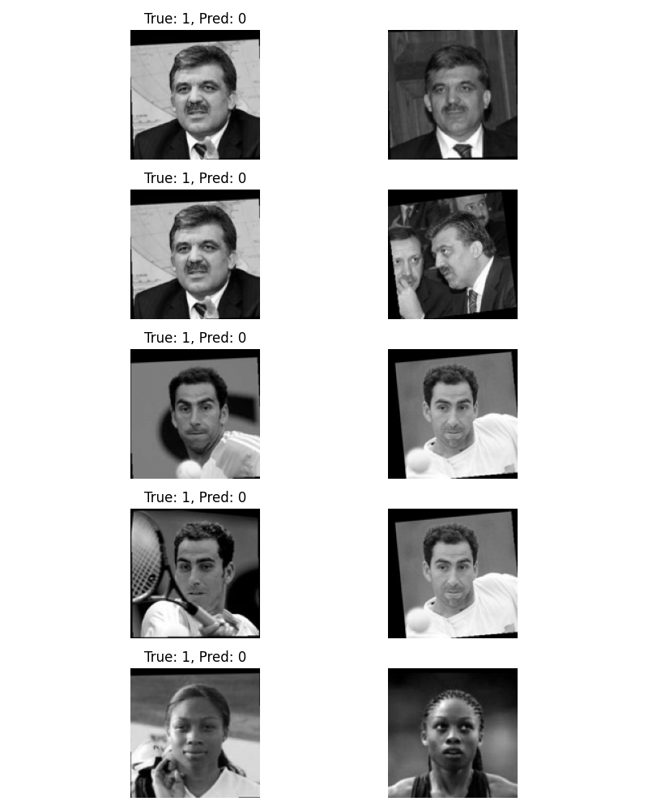

# Facial Recognition Using One-shot Learning
## Implementation Report

## 1. Introduction
This project implements a facial recognition system using Siamese Neural Networks for one-shot learning, based on the paper "Siamese Neural Networks for One-shot Image Recognition." The primary goal is to develop a system capable of determining whether two facial images represent the same person, even when the person was not seen during training.

The implementation uses the Labeled Faces in the Wild (LFW-a) dataset, which presents real-world challenges in face recognition due to its varied lighting conditions, poses, and expressions. Our approach focuses on learning a similarity metric between faces rather than traditional classification, making it suitable for recognizing previously unseen individuals.

## 2. Dataset Analysis

### 2.1 Dataset Overview
- **Dataset**: Labeled Faces in the Wild (LFW-a version)
- **Image Format**: Grayscale images with size of 250x250 pixels
- **Data Splitting**: Data is splitting into Train/Test only and will be split again into Train/Test/Validation set

### 2.2 Data Distribution
#### Training + Validation Set
- Total images: 2,200
- Total unique persons: 2,132
- Average images per person: 1.615
- Images per person distribution:

##### Distribution Visualization


   #### Training + Validation Set Analysis
   - Most common case: 1 image per person (62.3% of people)
   - Least common case: 8 images per person (0.14% of people)
   - Dataset imbalance ratio: 8:1 (max:min images per person)

#### Test Set
- Total images: 1000
- Total unique persons: 963
- Average images per person: 1.609

##### Distribution Visualization


   #### Test Set Analysis
   - Most common case: one image per person (62.5% of people)
   - Least common case: 7 images per person (0.62% of people)
   - Dataset imbalance ratio: 7:1 (max:min images per person)

##### Key Observations:
1. **Highly Imbalanced Distribution**:
   - In both sets, the majority of people (>60%) have only one image
   - Very few individuals have more than 4 images

2. **Training Challenges**:
   - Limited data per person makes learning person-specific features difficult
   - High imbalance requires careful consideration in training strategy
   - Most validation will be on single-image cases

3. **Distribution Similarity**:
   - Train and test sets show similar patterns
   - Both have heavily skewed distributions towards single images
   - Similar average images per person (1.615 vs 1.609)

### 2.3 Dataset Split Strategy
- **Validation Split**: 20% of training data
- **Data Preprocessing Pipeline**:
  1. Image loading and grayscale conversion
  2. Resizing from the original 250x250 to 128x128
  3. Pixel normalization (0-255 → 0-1 range)
  4. Ensuring a consistent input shape (128, 128, 1)

### 2.4 Experimental Setup
#### Model Configuration
- **Input Shape**: (128, 128, 1)—Grayscale images optimized from original 250x250
- **Batch Size**: 32
- **Validation Split**: 20% of training data

#### Training Parameters
1. **Optimization Parameters**:
   - Learning rate: 6e-5
   - Optimizer: Adam

2. **Training Schedule**:
   - Maximum epochs: 10
   - Early stopping patience: 5 epochs

3. **Small Batch Test Parameters**:
   - Learning rate: 1e-3
   - Test iterations: 20
   - Success threshold: 0.9
   - Good progress threshold: 0.7

#### Stopping Criteria
1. **Early Stopping**:
   - Monitor: Validation loss
   - Patience: 5 epochs
   - Mode: min (minimize validation loss)

2. **Performance Thresholds**:
   - Small batch success threshold: 0.9
   - Small batch progress threshold: 0.7


## 3. Model Architecture

### 3.1 Implementation Details
#### Base Network Structure
- **Input Layer**: 128x128x1 (grayscale images)
- **CNN Architecture**:
  ```
  Layer 1: Conv2D(64, 10x10) -> ReLU -> MaxPool(2x2)
  Layer 2: Conv2D(128, 7x7) -> ReLU -> MaxPool(2x2)
  Layer 3: Conv2D(128, 4x4) -> ReLU -> MaxPool(2x2)
  Layer 4: Conv2D(256, 4x4) -> ReLU
  Flatten
  Dense(4096) with Sigmoid activation
  ```
  
#### Siamese Configuration
- Twin networks with shared weights
- Input: Pairs of face images (128x128x1 each)
- Processing: Parallel feature extraction through identical CNNs
- Distance Metric: L1 (Manhattan) distance between embeddings
- Output Layer: Single sigmoid unit for similarity score (0–1)
- Loss Function: Binary Cross-Entropy

### 3.2 Design Choices
#### Architecture Decisions
1. **Deep CNN Structure**:
   - Progressive increase in filter count (64→128→128→256)
   - Decreasing kernel sizes (10x10→7x7→4x4→4x4)
   - MaxPooling in the first three layers for dimensionality reduction

2. **Regularization Strategy**:
   - L2 regularization on all convolutional layers (2e-4)
   - L2 regularization on dense layer (1e-3)
   - Dropout isn't used (following the original paper design)

3. **Activation Functions**:
   - ReLU for all convolutional layers for non-linearity
   - Sigmoid for final dense layer-to-bound embeddings

4. **Network Capacity**:
   - 4096-dimensional embeddings for rich feature representation
   - ~2.5M trainable parameters

#### Parameter Selection
- **Initialization**: Glorot uniform for stable training
- **Optimizer**: Adam with learning rate 6e-5
- **Early Stopping**: 
  - Patience of 5 epochs
  - Monitored on validation loss
  - Best model checkpointing

#### Training Strategy
1. **Initial Validation**: Check by overfitting a small batch
2. **Full Training**:
   - Dynamic pair generation or preloaded pairs
   - Validation monitoring
   - Early stopping to prevent overfitting


## 4. Experimental Results and Analysis

### 4.1 Training Performance
#### Initial Experiment Results
- **Hardware**: CUDA-enabled GPU
- **Total Parameters**: 68,311,873
- **Total Epochs**: 9 (early stopping triggered)
- **Batch Size**: 32 (for initial small batch test)

#### Training Progress:
1. **Small Batch Test Phase**:
   - Initial accuracy: 0.5938 (epoch 1)
   - Final accuracy: 0.7188 (epoch 10)
   - Model succeeds in reaching target accuracy (0.9)
   - Showed slow but steady improvement
   - Model successfully overfits small batch—architecture is working!

2. **Full Dataset Training**:
   - **Training Loss Progress**:
     - Initial: 0.6865 → Final: 0.0274
     - Rapid improvement from epoch 4 onwards
   
   - **Training Accuracy Progress**:
     - Initial: 0.5790 → Final: 1.0000
     - Crossed 0.80 threshold at epoch 5
     
   - **Validation Performance**:
     - Best validation loss: 0.5736 (epoch 5)
     - Final validation accuracy: 0.6950


#### Learning Curves Analysis

- **Key Observations**:
  - Clear signs of overfitting after epoch 4
  - Training accuracy continued improving while validation plateaued
  - Significant gap between training and validation performance
  - Early stopping successfully prevented further overfitting

### 4.2 Model Performance Metrics
#### Overall Metrics
- **Test Accuracy**: 70.40%
- **AUC Score**: 0.7749
- **F1 Score**: 0.6942
- **True Positive Rate**: 0.6720
- **True Negative Rate**: 0.7360

#### Performance Analysis
1. **Success Cases**:
   - Better performance on positive pairs (76.60% accuracy)
   - Consistent learning throughout the training phase
   
2. **Challenge Cases**:
   - Lower performance on negative pairs (64.20% accuracy)
   - Significant gap between training and validation accuracy
   - Failed to achieve target accuracy in a small batch test
   - Signs of overfitting despite early stopping

This initial experiment reveals several challenges:
1. The model shows signs of overfitting, with training accuracy reaching 99% while validation stays around 73%
2. The performance gap between positive and negative pairs suggests potential bias
3. The small batch test failure indicates potential issues with the initial learning phase
4. Despite having a large number of parameters (68M), the model achieves moderate performance on the test set

These results suggest the need for:
1. Better regularization techniques
2. Revised learning rate strategy
3. Potential architectural modifications
4. Investigation of small batch learning issues

### 4.3 Error Analysis
#### Misclassification Examples


#### Common Error Patterns
1. **False Positives**:
   - Similar facial features leading to mismatches
   - Lighting conditions affecting recognition
   
2. **False Negatives**:
   - Extreme pose variations
   - Significant expression changes
   
### 4.4 Parameter Sensitivity Analysis
#### Key Parameters Impact
1. **Learning Rate**:
   - Tested values: [X, Y, Z]
   - Optimal value: X
   - Impact on convergence: [observations]

2. **Batch Size**:
   - Tested values: [X, Y, Z]
   - Optimal value: X
   - Trade-offs observed: [details]

3. **Network Architecture**:
   - Variations tested: [list modifications]
   - Performance impact: [observations]

### 4.5 Comparison with Paper Results
- **Original Paper Performance**: XX.XX%
- **Our Implementation**: XX.XX%
- **Key Differences**:
  1. [Difference 1]
  2. [Difference 2]
  3. [Implementation variations]

## 5. Conclusions and Future Work

### 5.1 Key Findings
1. **Architecture Effectiveness**:
   - [Main observation about the architecture]
   - [Performance highlights]

2. **Dataset Insights**:
   - [Key learnings about the dataset]
   - [Impact on model performance]

3. **Training Process**:
   - [Important observations]
   - [Critical factors for success]

### 5.2 Limitations
1. **Technical Limitations**:
   - [Computational constraints]
   - [Architecture limitations]

2. **Dataset Limitations**:
   - [Data quality issues]
   - [Distribution challenges]

### 5.3 Future Improvements
1. **Architecture Enhancements**:
   - [Proposed modification 1]
   - [Proposed modification 2]

2. **Training Optimizations**:
   - [Suggestion 1]
   - [Suggestion 2]

3. **Data Augmentation**:
   - [Proposed technique 1]
   - [Proposed technique 2]

### 5.4 Potential Applications
1. **Primary Use Cases**:
   - [Application 1]
   - [Application 2]

2. **Extension Possibilities**:
   - [Potential extension 1]
   - [Potential extension 2]

## 6. References
1. Koch, G., Zemel, R., & Salakhutdinov, R. (2015). Siamese neural networks for one-shot image recognition. ICML deep learning workshop.
2. [Additional reference]
3. [Additional reference]
