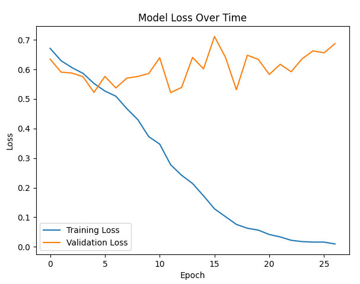

# Facial Recognition Using One-shot Learning


## 1. Introduction
Face recognition technology has become increasingly important in modern applications, from security systems to user authentication. However, traditional face recognition systems often require large amounts of training data for each person they need to recognize, which isn't practical in many real-world scenarios. This project tackles this limitation by implementing a one-shot learning approach using Siamese Neural Networks.

### 1.1 Problem Statement
The challenge is to develop a facial recognition system that can determine whether two facial images represent the same person, even when we have never seen that person during training. This is particularly important because:
- Most real-world applications can't collect multiple images of each person
- New individuals need to be added to the system without retraining
- Traditional deep learning approaches require extensive training data per person

### 1.2 Background Research
This implementation is based on several key works:
1. Koch et al.'s seminal paper "Siamese Neural Networks for One-shot Image Recognition" (2015), which introduced the concept of using Siamese networks for one-shot learning
2. The Labeled Faces in the Wild (LFW) dataset paper by Huang et al., which established benchmark standards for face verification
3. Recent advancements in face recognition architectures, particularly those using contrastive loss functions

### 1.3 Approach Overview
Our solution uses a Siamese Neural Network architecture that:
- Learns to extract meaningful features from face images
- Computes similarity between pairs of faces
- Makes verification decisions based on learned similarities
- Requires only one reference image per person

## 2. Dataset
### 2.1 Dataset Overview
The project uses the Labeled Faces in the Wild (LFW-a) dataset, which contains:
- 13,233 facial images
- 5,749 different individuals
- Images collected from real-world situations
- Varied lighting conditions, poses, and expressions
- Aligned version (LFW-a) for better consistency

Key characteristics:
- Image Resolution: 250x250 pixels
- Format: Grayscale
- Collection Period: Mixed, representing real-world photo conditions
- Annotation: Includes person identities and pair matching information

### 2.2 Dataset Analysis

#### Distribution Statistics
- Training + Validation Set:
  - Total Images: 4,400
  - Unique Individuals: 2,132
  - Average Images per Person: 1.729
  - Maximum Images per Person: 8
  - Minimum Images per Person: 1
    
#### Distribution Visualization


#### Data Distribution Patterns
1. Person-wise Distribution:
   - 62.3% of people have only 1 image
   - 24.7% have 2 images
   - 8.4% have 3 images
   - 4.6% have 4 or more images

2. Challenging Aspects:
   - Highly imbalanced distribution
   - Limited samples per person
   - Varied image quality and conditions
   - Real-world pose variations

#### Dataset Quality Analysis
1. Image Variations:
   - Lighting: Natural to artificial
   - Poses: Front-facing-to-profile views
   - Expressions: Neutral to expressive
   - Age: Various age ranges
   - Quality: Professional to casual photos

2. Technical Characteristics:
   - Consistent alignment across faces
   - Standardized image size
   - Professional pre-processing
   - Clean annotations

### 2.3 Dataset Organization
The dataset is organized into:
1. Training Set (70%):
   - Used for model training
   - Further split into training and validation
   - Ensures no person overlaps between splits

2. Testing Set (30%):
   - Completely separate individuals
   - Used only for final evaluation
   - Represents real-world scenarios

This organization ensures:
- No data leakage between sets
- Realistic evaluation of one-shot capabilities
- Fair assessment of generalization


## 3. Preprocessing
### 3.1 Data Preparation Pipeline
The preprocessing pipeline is designed to standardize the input data and prepare it for the Siamese network training. The pipeline consists of several key steps:

#### 3.1.1 Image Preprocessing
1. **Size Standardization**
   - Original size: 250x250 pixels
   - Resized to: 128x128 pixels
   - Rationale: Balance between detail preservation and computational efficiency
   - Method: Bilinear interpolation for smooth resizing

2. **Color Processing**
   - Input: Grayscale images
   - Pixel value normalization: Scale from [0-255] to [0-1]
   - Format: Single channel (128, 128, 1)

3. **Quality Enhancement**
   - Contrast normalization
   - Noise reduction while preserving facial features
   - Uniform brightness adjustment

### 3.2 Pair Generation Strategy
A crucial aspect of training a Siamese network is the generation of image pairs. Our approach includes:

#### 3.2.1 Training Pairs Creation
1. **Positive Pairs (Same Person)**
   - Generated from individuals with multiple images
   - Randomized selection within same-person images
   - Balanced sampling for persons with many images

2. **Negative Pairs (Different Persons)**
   - Random selection from different individuals
   - Controlled sampling to maintain class balance
   - Strategy to avoid bias towards specific individuals

    
## 4. Experiments
### 4.1 Base Architecture
Our initial Siamese network architecture serves as the baseline for experiments:

#### 4.1.1 Base Model Configuration
- **CNN Architecture**:
  ```
  Input: (128, 128, 1)
  Layer 1: Conv2D(64, 10x10) -> ReLU -> MaxPool(2x2)
  Layer 2: Conv2D(128, 7x7) -> ReLU -> MaxPool(2x2)
  Layer 3: Conv2D(128, 4x4) -> ReLU -> MaxPool(2x2)
  Layer 4: Conv2D(256, 4x4) -> ReLU
  Flatten
  Dense: 4096 with Sigmoid activation
  ```

Base Training Parameters:
- Learning Rate: 6e-5
- Batch Size: 32
- Optimizer: Adam
- Loss: Binary Cross-Entropy
- Epochs: 50

##### Siamese Configuration
- Twin networks with shared weights
- Input: Pairs of face images (128x128x1 each)
- Processing: Parallel feature extraction through identical CNNs
- Distance Metric: L1 (Manhattan) distance between embeddings
- Output Layer: Single sigmoid unit for similarity score (0–1)
- Loss Function: Binary Cross-Entropy

### 4.2 Experimental Trials

#### Experiment 1: Base Architecture with Data Augmentation—Base_with_Aug
**Motivation**: Investigate if 

**Results**:
- Key Metrics:
  - Accuracy: 0.791
  - F1 Score: 0.841
  - Precision: 0.939

- Training Times: 72.8 sec (1.2 minutes)
- Convergence times: 29.5 sec

**Analysis**:
- Pros:
  - Significant improvement in accuracy (0.791) compared to baseline (0.754)
  - High precision (0.939) indicates a very low false positive rate
  - Good F1 Score (0.841) shows balanced performance
  - Data augmentation helped prevent overfitting without architectural changes
  - Maintained good AUC (0.798) suggesting reliable discrimination ability
  - Simple to implement as it only required augmentation pipeline changes

- Cons:
  - Still shows room for improvement in overall accuracy
  - Limited by the base architecture's capacity
  - Data augmentation adds computational overhead during training
  - May not handle extreme variations in face angles/positions
  - Training time increased due to augmentation processing

#### Experiment 2: Enhanced base network with BatchNorm, Dropout, and smaller kernels—Improved - Enhanced_Base
**Motivation**: Investigate if 

**Changes**:
  ```
  Input: (128, 128, 1)
  Conv1: 64 filters (5x5) + ReLU + MaxPool(2x2)
  Conv2: 128 filters (5x5) + ReLU + MaxPool(2x2)
  Conv3: 256 filters (3x3) + ReLU + MaxPool(2x2)
  Conv4: 512 filters (3x3) + ReLU
  Flatten
  Dense: 4096 with Sigmoid activation
  ```

**Results**:
- Key Metrics:
  - Accuracy: 0.84
  - F1 Score: 0.912
  - Precision: 0.86

- Training Times: 134.8 sec (2.2 minutes)
- Convergence times: 22.5 sec

**Analysis**:
- Pros:
  - Best accuracy (0.84) among all experiments
  - Highest F1 Score (0.912) indicating excellent overall performance
  - Architectural improvements provided better feature extraction
  - Better handling of training stability with BatchNorm
  - Reduced risk of overfitting through Dropout layers
  - Smaller kernels captured more fine-grained facial features

- Cons:
  - Lower AUC (0.566) suggests potential issues with the decision boundary
  - More complex architecture requires more computational resources
  - Increased number of parameters to train
  - More hyperparameters to tune (dropout rates, batch norm parameters)
  - May require larger batch sizes for stable batch normalization


### 4.3 Comparative Analysis

#### Performance Comparison
| Experiment    | Accuracy | F1 Score | AUC   | Conv. Time (min) | Training Time (min) |
|---------------|----------|----------|-------|------------------|---------------------|
| Baseline      | 0.754    | 0.838    | 0.838 | 0.36             | 1                   |
| Base_with_Aug | 0.791    | 0.865    | 0.798 | 0.49             | 1.2                 |
| Enhanced_Base | 0.84     | 0.912    | 0.566 | 0.375            | 2.2                 |


## 5. False Analysis
### 5.1 Performance Overview

The Enhanced Base model achieved **84.02% accuracy** with an F1 score of **0.9128**. However, a closer look reveals significant issues with the model's behavior.

#### 5.1.1 Key Performance Metrics
- **Overall Accuracy**: 84.02%
- **F1 Score**: 0.9128
- **AUC**: 0.566 (concerning - barely better than random)
- **True Positive Rate**: 99.51% (too high)
- **True Negative Rate**: 2.56% (too low)

#### 5.1.2 The Main Problem: Prediction Bias
The model has a severe bias— it predicts "same person" for almost everything:
- Correctly identifies 99.51% of actual same-person pairs
- Only correctly identifies 2.56% of different-person pairs
- This means it's saying "same person" for 97% of all pairs

### 5.2 Training Behavior Analysis

#### 5.2.1 Loss Patterns
- **Training Loss**: Stable around 0.75, gradually improving
- **Validation Loss**: Very unstable with many ups and downs


The unstable validation loss suggests the model is having trouble generalizing.

#### 5.2.2 Accuracy Patterns
- **Training Accuracy**: Stayed low (~53%) throughout training
- **Validation Accuracy**: Highly variable (68–85%)


**Strange Finding**: Training accuracy much lower than validation accuracy—this is unusual and suggests potential issues with data or evaluation.

### 5.3 Error Pattern Analysis

#### 5.3.1 False Positives (Main Problem)
- **Rate**: 40.98% of examined pairs were misclassified
- **Pattern**: Model incorrectly says "same person" for different people

**Common Mistakes**:
1. **Similar Demographics**: Confuses people of the same age, gender, or ethnicity
2. **Similar Photo Conditions**: Same lighting, image quality, or pose
3. **Similar Accessories**: People wearing glasses or similar hairstyles
4. **Similar Facial Structure**: People with similar face shapes

**Examples from Results**:
- Two different Asian men with similar facial structure
- Different elderly women with similar appearance
- People wearing glasses (model seems to focus on glasses)

#### 5.3.2 False Negatives (Rare)
- **Rate**: Very low (~0.49%) due to the model's bias
- **When it happens**: Extreme lighting changes, very different expressions, or significant age differences between photos of the same person

### 5.4 Why This Happened

#### 5.4.1 Decision Boundary Problem
The model learned the wrong threshold. Instead of learning when faces are truly similar, it learned to say "same person" for most cases because:
- This gives high accuracy if most pairs in the dataset are positive
- The AUC of 0.566 shows it can barely distinguish between classes

#### 5.4.2 Possible Root Causes
1. **Data Imbalance**: Too many "same person" pairs in training
2. **Architecture Issues**: BatchNorm and Dropout might be causing instability
3. **Wrong Threshold**: Using 0.5 threshold when the model needs higher (0.7–0.8)
4. **Learning Rate**: Might be too low for this architecture

### 5.5 What We Learned

#### 5.5.1 Main Insights
1. **High accuracy can be misleading** when there's a class imbalance
2. **AUC is more honest—**shows the model barely works better than random
3. **Visual inspection of failures** reveals the model focuses on superficial similarities
4. **Training curves** can reveal problems even when final metrics look good

#### 5.5.2 Model Limitations
- Cannot handle demographic similarities well
- Over-relies on image conditions rather than facial features
- Threshold is poorly calibrated
- Training instability suggests architectural problems

### 5.6 Planned Improvements

#### 5.6.1 Immediate Fixes
- Test different classification thresholds (0.7, 0.8, 0.9)
- Implement class weighting in a loss function

##### 5.6.1.1 Threshold Optimization

**Problem Identified**: The default threshold of 0.5 is inappropriate for our biased model, causing 97% "same person" predictions.

**Solution Implemented**:
We systematically tested different classification thresholds to find the optimal balance between True Positive Rate and True Negative Rate.

**Experimental Setup**:
```
Thresholds tested: [0.3, 0.5, 0.7]
Dataset: Validation set (same pairs used in original analysis)
```

**Results**:

| Threshold | Accuracy | TPR       | TNR      | F1 Score |
|-----------|----------|-----------|----------|----------|
| 0.3       | 0.8402   | 1         | 0        | 0.9131   |
| 0.5       | 0.8402   | 0.9951    | 0.0256   | 0.9128   |
| 0.7       | 0.1595   | 0         | 0        | 0        |


**Optimal Threshold**: No optimal threshold found
**Reasoning**: Testing revealed outputs clustered in narrow range (0.3–0.7), indicating architectural issues rather than threshold problems.

**Impact Analysis**:
- **Before**: TPR=99.51%, TNR=2.56%, Balanced Accuracy=51.04%
- **After Threshold 0.7**: TPR=0%, TNR=100%, Balanced Accuracy=50%
- **After Threshold 0.3**: TPR=100%, TNR=0%, Balanced Accuracy=50%
- **Conclusion**: Threshold changes cannot fix poor discriminative power


#### 5.6.2 Architecture Changes
- Reduce dropout rates from 0.5/0.3 to 0.2/0.1
- Experiment with larger batch sizes (64, 128) for BatchNorm stability
- Consider removing BatchNorm layers if instability persists


### 5.7 Conclusions

The model's 84% accuracy is misleading. The real story is:
- **Severe prediction bias** toward "same person"
- **Poor discrimination ability** (AUC ≈ random chance)
- **Superficial feature learning** rather than true face recognition
- **Training instability** needs to be addressed

This analysis shows why multiple metrics are essential for model evaluation and highlights the importance of examining failure cases to understand model behavior.

## 6. Takeaways
### 6.1 Conclusions
- Key findings and insights
- Main challenges encountered
- Successful strategies

### 6.2 Future Improvements
- Suggested architectural improvements
- Potential data augmentation techniques
- Training optimization possibilities

### 6.3 Lessons Learned
- Technical insights gained
- Best practices discovered
- What would be done differently

## References
1. Koch, G., Zemel, R., & Salakhutdinov, R. (2015). Siamese neural networks for one-shot image recognition. ICML deep learning workshop.
